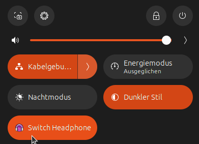
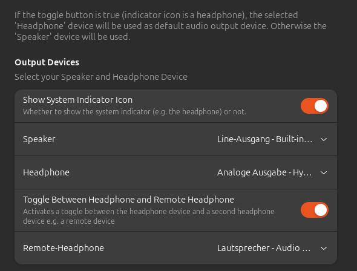
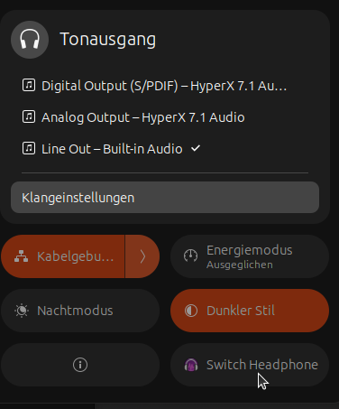
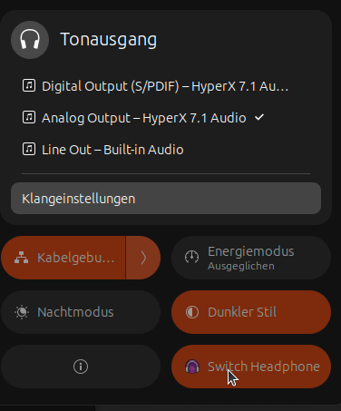
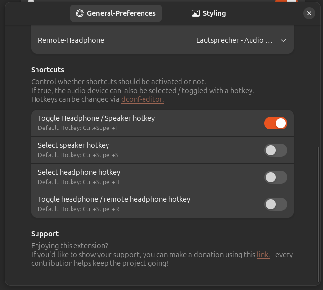

# ToggleAudio Extension

Settings

set your `headphone` and `speaker` devices in preferences

then you can switch between those `devices` with a click of a button:

 

(you can see the switch between the audio sources in the volume output device window above called `Tonausgang` here)

 Note: the devices for `headphone` and `speaker` must be two separated devices, and not a shared one with different ports (like build in Speaker/Headphone devices).

 In that case only one device can be seen in the preference selection window.

 With the `Show Indicator` switch you can also control if you want to show a system icon tray or not.
 If `true` the icon is shown.

## Hotkeys

 You can also use `hotkeys` for:

* toggle Speaker/ Headphone
  * default: <kbd>ctrl</kbd>+<kbd>super</kbd>+<kbd>T</kbd>
* select Speaker
  * default: <kbd>ctrl</kbd>+<kbd>super</kbd>+<kbd>S</kbd>
* select Headphone
  * default: <kbd>ctrl</kbd>+<kbd>super</kbd>+<kbd>H</kbd>

You can `enable` those in the settings:

>[!NOTE]
> if you want to change the hotkeys, you need to do those in gsettings using `gsettings`
>
>the path is: /org/gnome/shell/extensions/toggle-audio/
>
>Follow the instructions [on the wiki](https://github.com/Blackstareye/toggleAudio-blackeyeprojects.de/wiki/Changing-hotkeys)

## Icon Style

You can **control** whether you want to use colorful or symbolic monochrome icons.

PS: You can even [customize](https://github.com/Blackstareye/toggleAudio-blackeyeprojects.de/wiki/Styling-and-Customization) the used icons if you want

## Tested on

with 2 audio devices:

* Gnome 48;
  * Fedora 42
* Gnome 47:
  * EndeavourOS Linux
  * Nobara
* Gnome 46:
  * Ubuntu 24.04 (hardware)
* Gnome 45:
  * Ubuntu 23.10 (VM)
  * Nobara 39

## Next Version

Ideas:

* Disable Toggle Button as long Connection is not possible instead just queuing  

## Now with multi-lang-support

Contribution of translations files are appreciated.

Please file an issue or PR for that.

### Already implemented translations

* German 
* English
* Hungarian

## Thanks and credit to

* [audio-selector@harald65.simon.gmail.com](https://github.com/hs65/Gnome-Shell-Extension-Audio-Selector)
* [quicksettings-audio-devices-hider@marcinjahn.com](https://github.com/marcinjahn/gnome-quicksettings-audio-devices-hider-extension)

* [mediacontrols@cliffniff.github.com](https://github.com/cliffniff/media-controls)

their code helped me to understand `Gvc.MixerControl` better.

Also thanks to #extensions:gnome.org (Matrix) and their people for helping me :)

## Support

If you like my work and want to support me, then this is the way:

* [kofi](https://ko-fi.com/black_eye)

Many Thanks ♥
