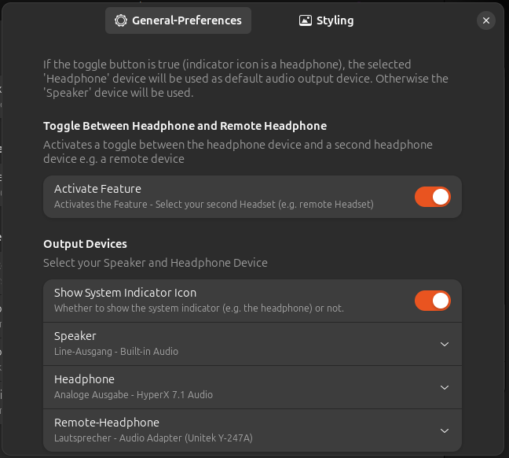

# ToggleAudio Extension

## Screenshots

set your Audio-Devices in preferences - Note: it must be separated devices, not a shared one with different ports (like build in Speaker/Headphone devices)

then you can swithc between those `devices` with a click of a button:

 

(you can see the switch in the volume output device window above called `Tonausgang` here)

## Tested on

with 2 audio devices:

* Gnome 46:
  * Ubuntu 24.04 (hardware)
* Gnome 45:
    * Ubuntu 23.10 (VM)
    * Nobara 39

## Next Version

Ideas:

* Disable Toggle Button as long Connection is not possible instead just queuing  
* Change Toggle Button to ToggleButton with Menu, and move Pref to this menu instead of pref settings.

## Thanks and credit to

* [audio-selector@harald65.simon.gmail.com](https://github.com/hs65/Gnome-Shell-Extension-Audio-Selector)
* [quicksettings-audio-devices-hider@marcinjahn.com](https://github.com/marcinjahn/gnome-quicksettings-audio-devices-hider-extension)

* [mediacontrols@cliffniff.github.com](https://github.com/cliffniff/media-controls)

their code helped me to understand `Gvc.MixerControl` better.

Also thanks to #extensions:gnome.org (Matrix) and their people for helping me :)
